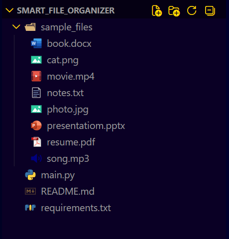
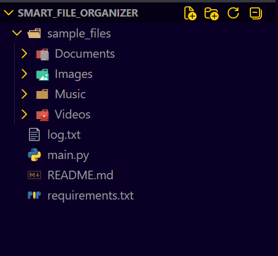
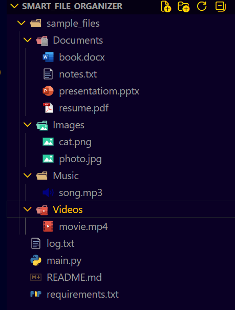
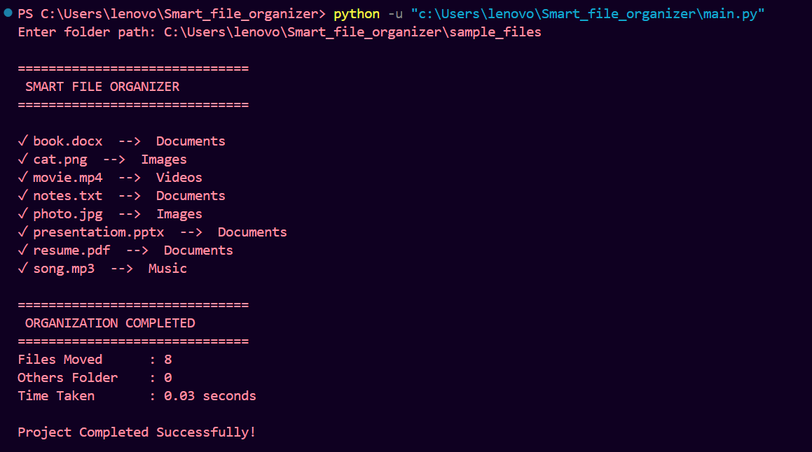
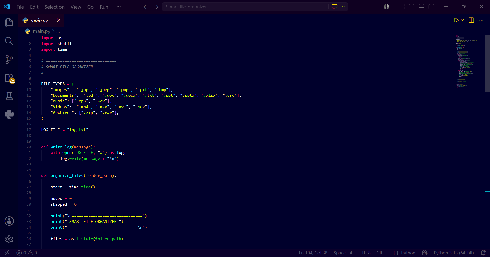
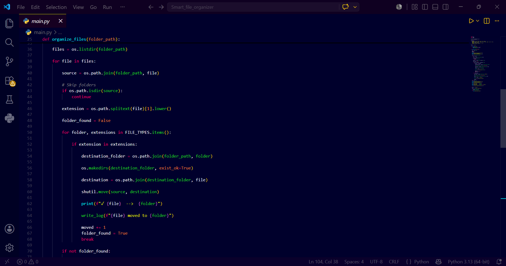
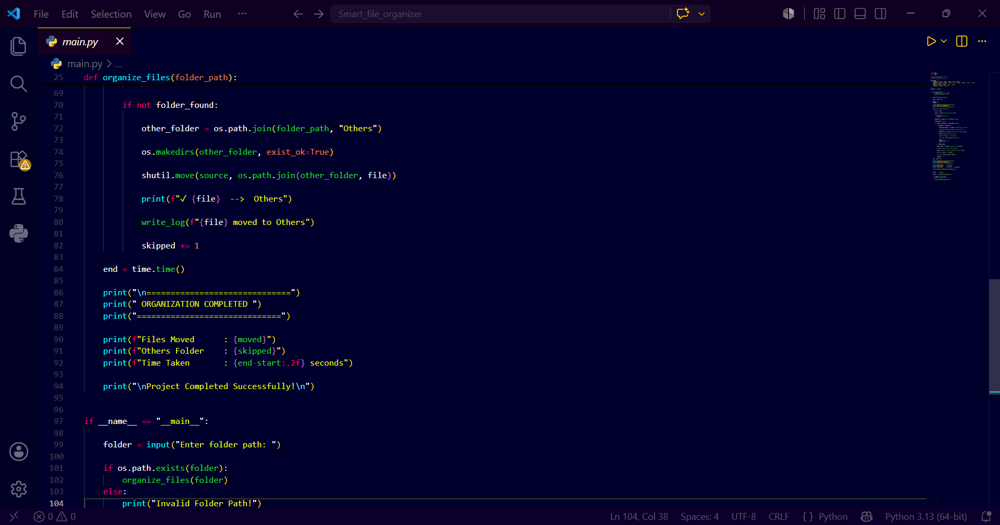

# 📂 Smart File Organizer

A Python automation project that automatically organizes files into folders based on their extensions.

## Features

- Automatically detects file types
- Creates folders automatically
- Organizes Images, Documents, Music, Videos and Archives
- Unknown files are moved to an Others folder
- Generates a log file
- Displays execution time
- Modular and reusable code

## Technologies Used

- Python
- OS Module
- Shutil Module
- Time Module

## Folder Structure

sample_files/
│
├── Images
├── Documents
├── Music
├── Videos
├── Archives
└── Others

## 📸 Project Screenshots

### Before Organization

### After Organization

#### After - View 1

#### After - View 2

### Terminal Output

### GitHub Repository

#### Repository View 1

#### Repository View 2

#### Repository View 3

